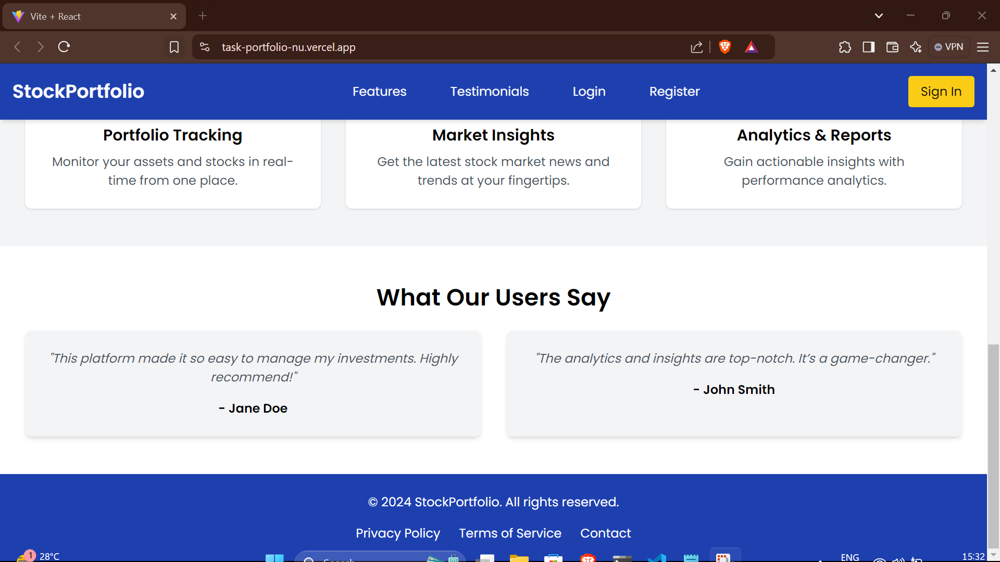
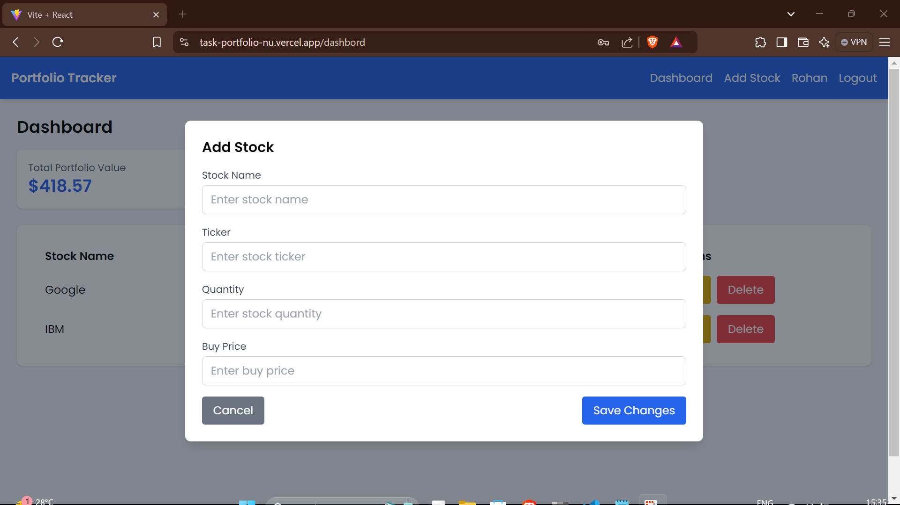

# **Portfolio Website - Task Manager**

This project is a portfolio website that includes a task management feature. The website has two main components:
- **Frontend**: Built using **React**.
- **Backend**: Built using **Django** with **SQLite** as the database.

The frontend and backend are connected via APIs, enabling users to create, manage, and track their tasks.

## Demo Link:
You can access the live demo of the project here: [Task Portfolio Website](https://task-portfolio-nu.vercel.app/)

---

## **Table of Contents**

1. [About The App](#about-the-app)
2. [Screenshots](#screenshots)
3. [Technologies](#technologies)
4. [Frontend Setup (React)](#frontend-setup-react)
5. [Backend Setup (Django)](#backend-setup-django)

---

## **About The App**

The **Portfolio Website** allows users to manage their tasks through a simple, intuitive interface. Users can add, update, and delete tasks. The app displays the tasks in a list and provides real-time data updates. The project is a combination of a **React** frontend and a **Django** backend, utilizing an **SQLite** database for storage.

---

## **Screenshots**

Here are some screenshots of the app:

- **Homepage**

  

- **Platform Feature**

  

- **About**

  
- **Login**

  
- **Register**

  
- **Dashbord**

  
- **Add Stocks**

  

---

## **Technologies**

This project utilizes the following technologies:

- **Frontend**:
  - React.js for building the user interface.
  - React Router for routing.
  - Axios for API calls.
  - CSS for styling.
  
- **Backend**:
  - Django Framework.
  - Django Rest Framework for creating the API.
  - SQLite as the database.
  
- **Development**:
  - Node.js for React development.
  - Python for Django backend.

---

